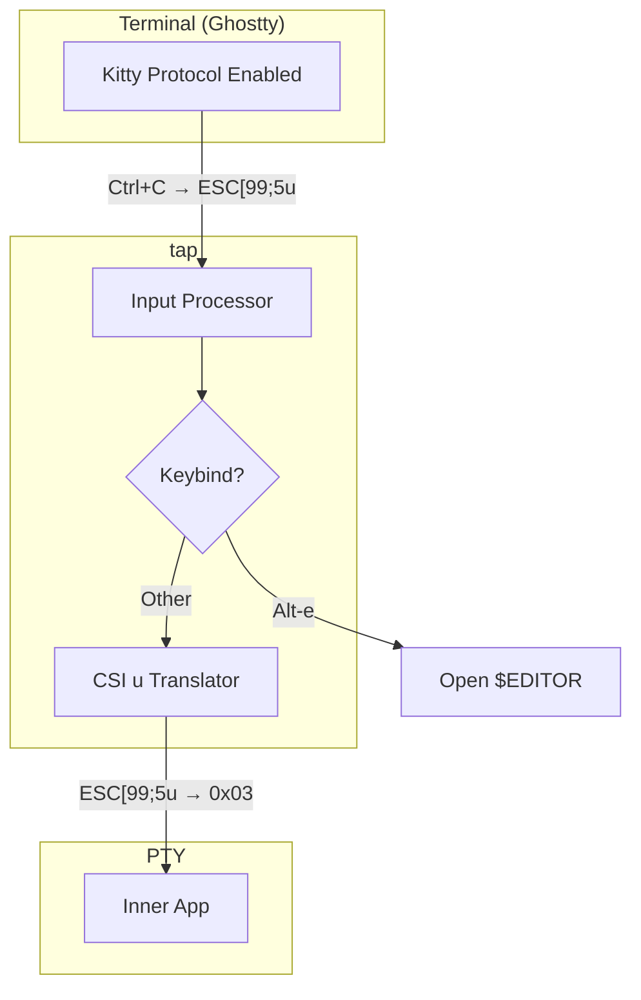

# Contributing

## Keyboard Input Flow

tap enables Kitty keyboard protocol on the outer terminal for enhanced key detection, then translates back to traditional sequences for inner apps.

### Why translate?

1. **tap enables Kitty protocol** on stdout to detect Alt-key combinations reliably
2. **Inner apps don't negotiate** - PTYs don't emulate protocol handshakes
3. **Always translate** CSI u sequences to traditional input (Ctrl+C = `0x03`)

### Key files

- `input.rs` - Keybind detection (Alt-e for editor)
- `kitty.rs` - CSI u → traditional translation
- `lib.rs` - Main I/O loop, applies translation before writing to PTY
