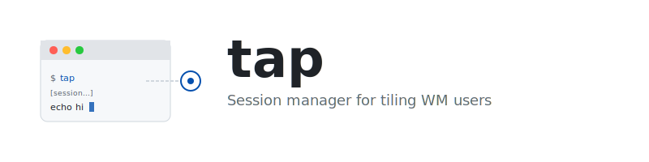
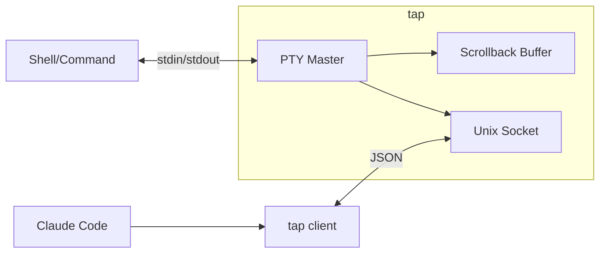

<p align="center">
  
</p>

<p align="center">
  <code>nix run github:andrewgazelka/tap</code>
</p>

Terminal session manager for tiling WM users. Detach and reattach to sessions without the overhead of tmux.

## The Problem

If you use a tiling window manager (i3, Sway, Aerospace, yabai), you already have window tiling. Running tmux means two competing systems: tmux tiles inside the terminal, your WM tiles windows. This creates:

- Conflicting keybindings (is `Ctrl+b` for tmux or your WM?)
- Nested navigation (WM to window, then tmux to pane)
- Redundant concepts (tmux panes vs terminal windows)

But tmux has one killer feature: **session persistence**. You can detach from a running process and reattach later. That's worth the overhead for some people.

## The Solution

`tap` gives you session persistence without the tiling overhead.

```sh
tap                    # start a session
# ... run your dev server ...
# close the terminal (or press Ctrl+\ to detach)

tap attach             # reattach from any terminal
```

Your window manager handles tiling. `tap` handles persistence. No conflicts.

## Features

- **Detach/Attach** - Close your terminal, reattach later
- **Background sessions** - Start processes that outlive your terminal
- **Scrollback capture** - Access terminal output programmatically
- **AI integration** - Claude Code can see and control tap sessions
- **Zero config** - Works out of the box, no `.tmux.conf` required

## Commands

```sh
tap                      # start interactive session
tap start htop           # run a command in a new session
tap list                 # list active sessions
tap attach [session]     # reattach to a session
tap detach               # detach from current session (or Ctrl+\)
tap scrollback [session] # get terminal output
tap inject "ls" [session] # type into a session
```

## Shell Integration

### Ghostty

Add to `~/.config/ghostty/config`:

```
command = tap
```

Now every new terminal window is automatically a tap session.

## Comparison

| Feature | tmux | screen | abduco | tap |
|---------|------|--------|--------|-----|
| Session persistence | yes | yes | yes | yes |
| Window/pane tiling | yes | yes | no | no |
| Config complexity | high | medium | low | none |
| Keybind conflicts with WM | yes | yes | minimal | minimal |
| Scrollback API | no | no | no | yes |
| AI tool integration | no | no | no | yes |

## Architecture



---

MIT
