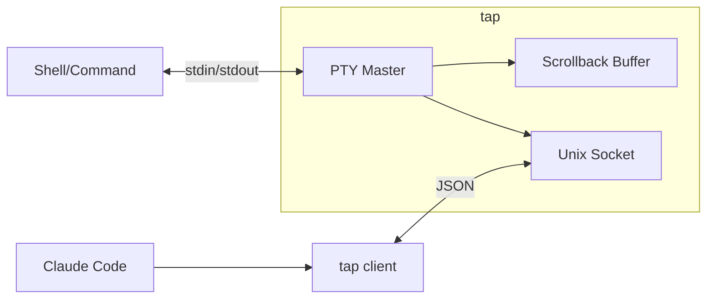

<p align="center">
  
</p>

<p align="center">
  <code>nix run github:andrewgazelka/tap</code>
</p>

Let Claude Code see and control your other terminal windows.

## The Problem

You're running a dev server in one terminal tab. You ask Claude Code to check if it's working. But Claude Code can't see that tab - it only sees its own terminal.

## The Solution

```sh
tap
```

Your shell works exactly the same - you won't notice any difference. But now Claude Code can see and type into this terminal in the background.

## Example

```sh
# Terminal 1
tap              # starts your normal shell, nothing changes
npm run dev      # use it like normal

# Meanwhile, Claude Code can:
# - See "Server running on :3000"
# - Run "curl localhost:3000" in this terminal
# - Watch for errors
```

## Commands

```sh
tap                  # start your normal shell
tap start htop       # or any command
tap list             # see active sessions
tap scrollback       # read terminal output
tap cursor           # get cursor position
tap size             # get terminal size
tap inject "ls"      # type into the terminal
tap subscribe        # stream live output
```

## Shell Integration

### Ghostty

Add to your Ghostty config (`~/.config/ghostty/config`):

```
command = tap
```

## Architecture



---

MIT
