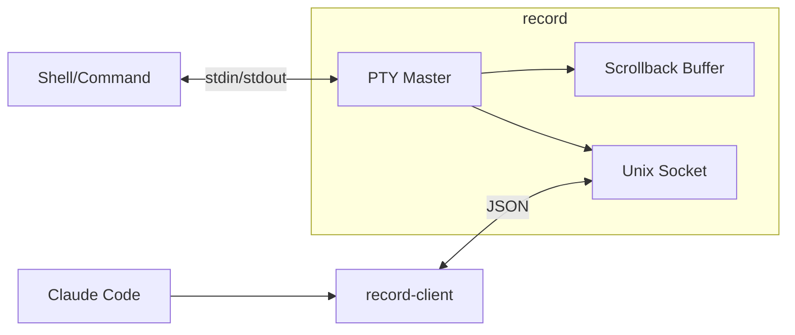

<p align="center">
  
</p>

<p align="center">
  <code>nix run github:andrewgazelka/record</code>
</p>

Let Claude Code see and control your other terminal windows.

## The Problem

You're running a dev server in one terminal tab. You ask Claude Code to check if it's working. But Claude Code can't see that tab - it only sees its own terminal.

## The Solution

```sh
record
```

Your shell works exactly the same - you won't notice any difference. But now Claude Code can see and type into this terminal in the background.

## Example

```sh
# Terminal 1
record           # starts your normal shell, nothing changes
npm run dev      # use it like normal

# Meanwhile, Claude Code can:
# - See "Server running on :3000"
# - Run "curl localhost:3000" in this terminal
# - Watch for errors
```

## Commands

```sh
record-client list         # see active sessions
record-client scrollback   # read terminal output
record-client inject "ls"  # type into the terminal
```

## Architecture



---

MIT
